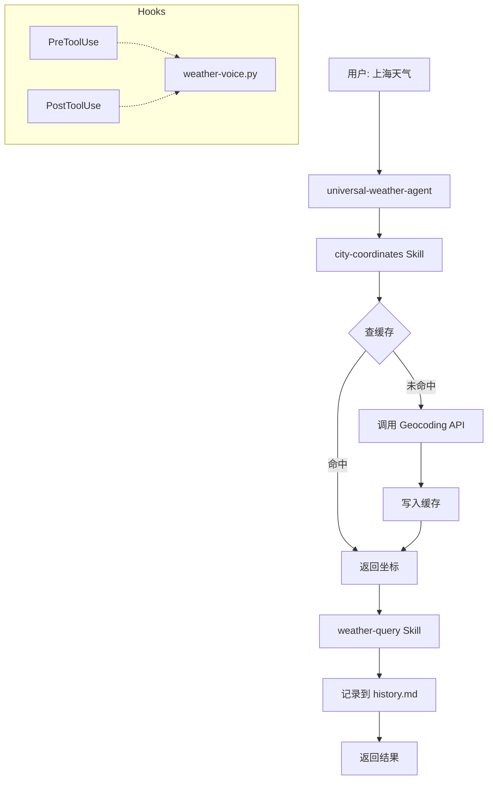

# 通用天气 Agent 开发任务清单

> 目标：构建一个支持任意城市天气查询的 Agent，具备坐标缓存、历史记录、语音播报功能。

## 需求规格

| 项目 | 规格 |
|------|------|
| 功能范围 | 当前温度 + 天气状况（晴/雨/云等） |
| 查询方式 | 单个城市查询 |
| 城市识别 | 调用地理编码 API 实时查坐标 |
| 坐标缓存 | 动态缓存到文件，逐步积累 |
| 历史记录 | 记录每次查询 |
| 模型 | Haiku（便宜快） |
| Hooks | 语音播报 |

---

## 阶段一：Skill 层（可复用的原子能力）

### 1.1 城市坐标 Skill（合并了地理编码 + 坐标缓存）✅

- [x] **产出文件**：`.claude/skills/city-coordinates/SKILL.md`
- [x] **功能**：输入城市名 → 输出经纬度坐标（内部自动处理缓存）
- [x] **内部逻辑**：
  1. 读 `coord-cache.json` → 有缓存则直接返回
  2. 缓存未命中 → 调用 Open-Meteo Geocoding API
  3. 将结果写入 `coord-cache.json`
  4. 返回坐标
- [x] **API**：Open-Meteo Geocoding（免费，无需 API Key）
  - URL: `https://geocoding-api.open-meteo.com/v1/search?name={城市名}&count=1&language=zh`
- [x] **缓存文件路径**：`.claude/agent-memory/universal-weather-agent/coord-cache.json`
- [x] **allowed-tools**：`Read`、`Write`、`WebFetch(*)`
- [x] **输出格式**：
  ```
  城市: 上海
  经度: 121.4737
  纬度: 31.2304
  来源: 缓存 / API
  ```

### 1.2 天气查询 Skill ✅

- [x] **产出文件**：`.claude/skills/weather-query/SKILL.md`
- [x] **功能**：输入经纬度 → 返回温度 + 天气状况
- [x] **API**：Open-Meteo Weather API
  - URL: `https://api.open-meteo.com/v1/forecast?latitude={lat}&longitude={lon}&current=temperature_2m,weather_code`
- [x] **weather_code 映射**：完整 WMO 4677 标准映射表（28 种天气状况）
- [x] **输出格式**：
  ```
  城市: 上海
  温度: 28°C
  天气: 多云
  ```

---

## 阶段二：数据文件 ✅

### 2.1 坐标缓存文件 ✅

- [x] **产出文件**：`.claude/agent-memory/universal-weather-agent/coord-cache.json`
- [x] **初始内容**：`{}`

### 2.2 查询历史文件 ✅

- [x] **产出文件**：`.claude/agent-memory/universal-weather-agent/history.md`
- [x] **初始内容**：带表头的空表

---

## 阶段三：Agent 定义 ✅

### 3.1 Agent 配置头 ✅

- [x] **产出文件**：`.claude/agents/universal-weather-agent.md`
- [x] **YAML 配置**：name、description、model(haiku)、color(blue)、maxTurns(8)、permissionMode(acceptEdits)、memory(project)、skills、hooks

### 3.2 Agent 指令正文 ✅

- [x] **工作流程**：5 步（解析城市 → 获取坐标 → 查天气 → 记历史 → 返回结果）
- [x] **Execution Contract**：禁止绕过 Skill 直接调 API（参考 weather-agent 的模式）
- [x] **错误处理**：每步失败都有明确的处理和终止逻辑
- [x] **输出格式**：带 emoji 的格式化结果 + 历史对比

### 3.3 Hooks 配置 ✅

- [x] **PreToolUse**：调用 weather-voice.py --event=start
- [x] **PostToolUse**：调用 weather-voice.py --event=done
- [x] **PostToolUseFailure**：调用 weather-voice.py --event=error（参考 weather-agent 补充了失败 hook）

---

## 阶段四：语音 Hooks ✅

### 4.1 Hook 脚本 ✅

- [x] **产出文件**：`.claude/hooks/scripts/weather-voice.py`
- [x] **功能**：接收 `--event` 参数（start / done / error），调用系统 TTS 播报
- [x] **macOS**：使用 `say -v Ting-Ting`（中文语音）
- [x] **Linux**：使用 `espeak -v zh`（兜底）
- [x] **设计决策**：采用轻量 TTS 方案，不依赖预录音频文件

### 4.2 语音素材（跳过）

- [x] 采用 TTS 实时生成，无需预录音频

---

## 阶段五：测试验证

### 5.1 冷启动测试

- [ ] 查询缓存中没有的城市（如"成都"）
- [ ] 验证流程：地理编码 → 写缓存 → 查天气 → 记历史
- [ ] 检查 `coord-cache.json` 是否新增了成都
- [ ] 检查 `history.md` 是否记录了本次查询

### 5.2 缓存命中测试

- [ ] 再次查询"成都"
- [ ] 验证：直接读缓存，不调用地理编码 API
- [ ] 对比两次查询的响应速度

### 5.3 边界测试

- [ ] 查询不存在的城市名（如"阿斯顿发噶"）
- [ ] 验证：返回友好的错误提示，不崩溃

### 5.4 语音测试

- [ ] 验证每次工具调用触发语音播报
- [ ] 验证音频播放不阻塞主流程（async: true）

---

## 执行顺序建议

```
Week 1: Skill 层
  ├─ Day 1: 1.1 城市坐标 Skill（地理编码 + 缓存，核心能力）
  └─ Day 2: 1.2 天气查询 Skill（独立，简单）

Week 2: Agent 整合
  ├─ Day 3: 2.1 + 2.2 创建数据文件
  ├─ Day 4: 3.1 + 3.2 Agent 配置和指令
  └─ Day 5: 5.1 + 5.2 + 5.3 功能测试

Week 3: 语音增强
  ├─ Day 6: 4.1 Hook 脚本
  ├─ Day 7: 3.3 Agent Hooks 配置
  └─ Day 8: 5.4 语音测试 + 收尾
```

---

## 依赖关系图



---

## 参考资料

- 参考 Agent：`.claude/agents/weather-agent.md`
- 参考 Skill：`.claude/skills/weather-fetcher/SKILL.md`
- Open-Meteo Geocoding API：https://open-meteo.com/en/docs/geocoding-api
- Open-Meteo Weather API：https://open-meteo.com/en/docs
